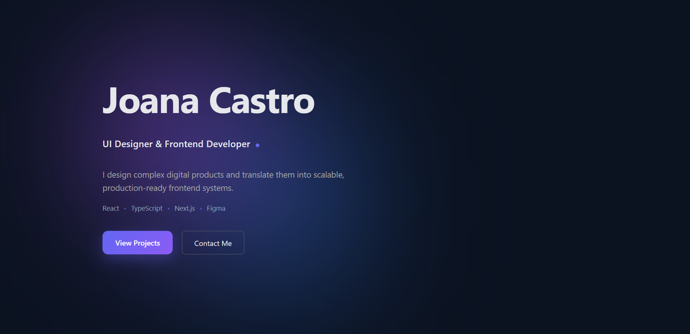
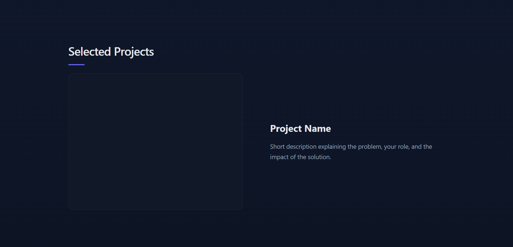
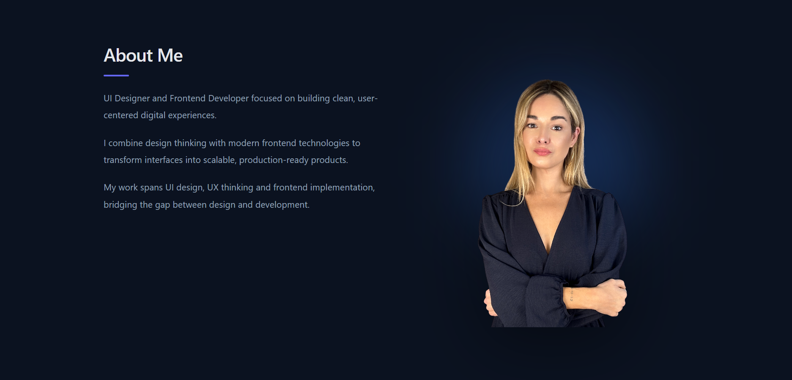

# 🚀 Joana Castro Portfolio


## 📸 Preview

### 🖥️ Hero


### 🎨 Portfolio


### 🧩 Tech Stack


### 👩‍💻 About Me

---

## ✨ About the Project

This is a personal portfolio website built with **React** to showcase my work, skills and approach to UI/UX design and frontend development.

The goal was to create a clean, modern and visually strong interface.

---

## ✨ Features

- Built with React
- Clean and modern UI
- Structured sections (Hero, About, Tech Stack, Portfolio)
- Component-based architecture
- Responsive layout (in progress)

---

## 🛠️ Tech Stack

- React  
- TypeScript  
- Vite  
- CSS  

---

## 🚀 Getting Started

### 1. Clone the repository

```bash
git clone https://github.com/joanadecastro/mywebsite-react.git
```

### 2. Install dependencies

```bash
npm install
```

### 3. Run the project

```bash
npm run dev
```

---

## 🎯 Purpose

This project was created to demonstrate:

- UI/UX design skills  
- Frontend development with React  
- Ability to build clean and modern interfaces  

---

## 👩‍💻 Author

**Joana Castro**

- LinkedIn:(https://www.linkedin.com/in/joanacastrowebdeveloper/) 


---

## 📌 Notes

This project is continuously evolving and will be improved with responsiveness and new features.